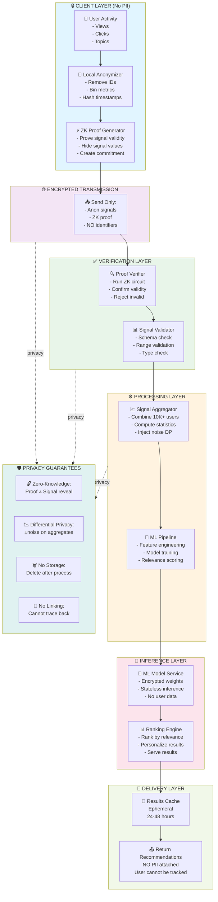

---

## System Diagram Components Explained

### 🔒 CLIENT LAYER (Privacy-First Entry Point)

**Purpose**: Anonymize before transmission

- **User Activity**: Continuous collection (never PII level)
- **Local Anonymizer**: Removes identifiers, bins metrics
- **ZK Proof Generator**: Creates mathematical proof of validity

**Privacy Guarantee**: No raw personal data ever leaves device

---

### 🌐 ENCRYPTED TRANSMISSION

**Purpose**: Secure channel for anonymous data only

- Sends: `{ anonymizedSignal, zkProof, noUserID }`
- Does NOT send: User ID, email, location, device ID

**Privacy Guarantee**: Content encrypted, endpoints privacy-preserving

---

### ✅ VERIFICATION LAYER

**Purpose**: Authenticate signal validity without seeing values

- **Proof Verifier**: Runs ZK circuit, returns yes/no (< 100ms)
- **Signal Validator**: Confirms schema, ranges, types

**Privacy Guarantee**: Zero-knowledge = no data revealed during verification

---

### ⚙️ PROCESSING LAYER

**Purpose**: Combine signals from 10K+ users into aggregates

- **Signal Aggregator**:
  - Combines with other users' anonymous signals
  - Adds differential privacy noise
  - Never stores individual signals
- **ML Pipeline**:
  - Trains on aggregates only
  - Feature engineering on cohort stats
  - No individual-level features

**Privacy Guarantee**: Aggregation irreversible (k-anonymity)

---

### 🎯 INFERENCE LAYER

**Purpose**: Generate personalized recommendations from aggregate models

- **ML Model**: Encrypted model weights, stateless computation
- **Ranking Engine**: Produces ranked recommendations (no PII)

**Privacy Guarantee**: Model trained on aggregates, outputs only scores

---

### 📨 DELIVERY LAYER

**Purpose**: Return results securely without re-identification risk

- **Results Cache**: 24-48 hour TTL, then deleted
- **Return**: Ranked recommendations (articles, topics, creators)

**Privacy Guarantee**: Results linked to session ID only, not user

---

## Data Flow Example

```
STEP 1: CLIENT
Raw: User views 3 AI articles (15m, 20m, 10m total)
└─> Anonymize: Engagement bucket [10-20m], Topic "Technology"
└─> Proof: Generate ZK proof of validity
└─> Send: (AnonymizedSignal + Proof), NO USER ID

STEP 2: NETWORK
└─> Encrypt transmission (HTTPS + TLS)
└─> No IP tracking, no device ID

STEP 3: SERVER VERIFICATION
└─> Verify proof: ✅ Valid
└─> Validate: ✅ Engagement in range, Topic in taxonomy
└─> Accept signal

STEP 4: AGGREGATION
└─> Combine with 50,000 other users viewing Technology
└─> Aggregate: Avg engagement = 18.5m, topic affinity 0.87
└─> Add noise: ±2% for DP

STEP 5: INFERENCE
└─> ML model (trained on aggregates): Topic "AI" → High relevance
└─> Generate recs: [Article A, Article B, Creator X]

STEP 6: DELIVERY
└─> Return recommendations (no way to trace to user)
└─> Cache expires after 48 hours
└─> Forget everything about this signal

RESULT: User gets personalized recommendations, zero PII exposed
```

---

## Privacy Boundaries Visualization

```
┌─────────────────────────────────────────────────────────┐
│ WHAT WE CAPTURE (With Protection)                       │
├─────────────────────────────────────────────────────────┤
│ ✅ Engagement metrics (binned, not exact)               │
│ ✅ Topic preferences (top-level only, aggregated)       │
│ ✅ Interaction types (categorical, no sequence)         │
│ ✅ Derived features (statistical aggregates only)       │
└─────────────────────────────────────────────────────────┘

┌─────────────────────────────────────────────────────────┐
│ WHAT WE NEVER CAPTURE (Strict Prohibition)             │
├─────────────────────────────────────────────────────────┤
│ ❌ User ID / Account number                             │
│ ❌ Email address                                        │
│ ❌ Phone number / Device identifiers                    │
│ ❌ Location / GPS / IP address                          │
│ ❌ Exact timestamps / Behavior sequences                │
│ ❌ Demographic info (age, gender, etc.)                 │
│ ❌ Medical / Financial / Health data                    │
│ ❌ Specific content (articles, videos, products)        │
│ ❌ Personal attributes                                  │
│ ❌ Communication with other users                       │
└─────────────────────────────────────────────────────────┘
```

---

## ZK-Proof Circuit Overview

### What Gets Proven (Without Revealing Values)

```
COMMITMENT: Hash of signal
│
├─ Signal validity constraints proven:
│  ├─ Engagement count: 0 < x < 1000 ✓
│  ├─ Topic in set: {Tech, Science, ...} ✓
│  ├─ Interaction type: Valid enum ✓
│  ├─ Timestamp: Within 30 days ✓
│  └─ Schema compliance: All fields present ✓
│
└─ PROOF OUTPUT: "Valid" (yes/no only)

Verifier learns:
✓ Signal structure is valid
✓ Values are in correct ranges
✓ Timestamp is recent
✗ NOTHING about actual values
✗ NOTHING about user identity
✗ NOTHING about signal content
```

---

## Differential Privacy Layer

### Aggregate Stats with Built-in Noise

```
TRUE AGGREGATE (never exposed):
  Users with AI interest: 47,382

REPORTED AGGREGATE (with noise):
  Users with AI interest: 47,382 ± 2,847 (±6%)

PROPERTY:
  Attacker cannot determine if individual X was in dataset
  By comparing: Before X → After X
  Because noise is >= information gain from 1 person
```

---

## Technology Stack Summary

```
FRONTEND:
├─ Signal Collection: JavaScript SDK
├─ Anonymization: crypto-js, Noble Crypto
├─ ZK Proof: circom + snarkjs
└─ Transport: HTTPS with cert pinning

BACKEND:
├─ Proof Verification: Arkworks (Rust) or libsnark (C++)
├─ Data Pipeline: Apache Kafka + Spark
├─ ML Inference: TensorFlow Serving
├─ Storage: Redis (ephemeral) + Postgres (aggregates only)
└─ API: gRPC with mTLS

INFRASTRUCTURE:
├─ Container: Docker
├─ Orchestration: Kubernetes
├─ Privacy Monitoring: Custom DP accounting
└─ Metrics: Prometheus + Grafana
```

---

## Compliance Alignment

| Regulation          | Requirement           | Our Solution                               |
| ------------------- | --------------------- | ------------------------------------------ |
| **GDPR Art. 5**     | Data minimization     | Only necessary signals captured, binned    |
| **GDPR Art. 25**    | Privacy by design     | ZK + DP built into architecture            |
| **GDPR Art. 17**    | Right to be forgotten | No personal data = automatic compliance    |
| **CCPA § 1798.100** | Right to know         | No PII to disclose, can publish aggregates |
| **CCPA § 1798.105** | Right to delete       | No linkable data to delete                 |
